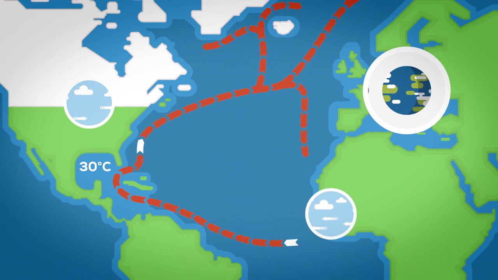

# iof0201-gulf-stream

```sh
podaac-data-downloader -c ECCO_L4_OCEAN_VEL_05DEG_MONTHLY_V4R4 -d ./data --start-date 1992-01-01T00:00:00Z --end-date 1992-01-08T00:00:00Z -b="-80,10,10,60"
```



## Objetivo

Estudar as informações do texto ["Scientists Say Ocean Circulation Is Slowing. Here’s Why You Should Care"](https://insideclimatenews.org/news/07052018/atlantic-ocean-circulation-slowing-climate-change-heat-temperature-rainfall-fish-why-you-should-care) do portal _InsideClimate News_.

Em particular a afirmação

> **"Studies suggest it would mean much colder winters and hotter summers in Europe, changing rainfall patterns in the tropics, and warmer water building up along the U.S. coast that can fuel sea level rise and destructive storms."**.

baseada na no paper ["Interstadial Rise and Younger Dryas Demise of Scotland's Last Ice Fields"](https://agupubs.onlinelibrary.wiley.com/doi/abs/10.1002/2018PA003341).


### Milestones

1. obter conclusões alinhadas ao paper ["2018 Continues Record Global Ocean Warming"](https://link.springer.com/article/10.1007%2Fs00376-019-8276-x)
2. construir um modelo capaz de aprender a dinâmica entre oceanos e clima.

## Recursos

### dados

+ [https://podaac.jpl.nasa.gov/dataset/REYNOLDS_NCDC_L4_SST_HIST_RECON_MONTHLY_V3B_ASC](https://podaac.jpl.nasa.gov/dataset/REYNOLDS_NCDC_L4_SST_HIST_RECON_MONTHLY_V3B_ASC) - UPDATE: impossível extrair as informações.
+ [Drifting platforms](https://www.nodc.noaa.gov/gocd/drportal.html) - This data set contains over 4 million surface current observations between 1894 and 1993, almost all obtained by the ship drift method.

### informações
+ [Effects of global warming on oceans](https://en.wikipedia.org/wiki/Effects_of_global_warming_on_oceans#Ocean_currents)
+ [The Gulf Stream Explained](https://www.youtube.com/watch?v=UuGrBhK2c7U&feature=youtu.be)
    + [Shutdown of thermohaline circulation](https://en.wikipedia.org/wiki/Shutdown_of_thermohaline_circulation)
    + [Paradoxically, one outcome of global warming could be a dramatic cooling of Britain and northern Europe](https://www.hyperhistory.com/online_n2/connections_n2/climate_n2/gulfstream.html)
